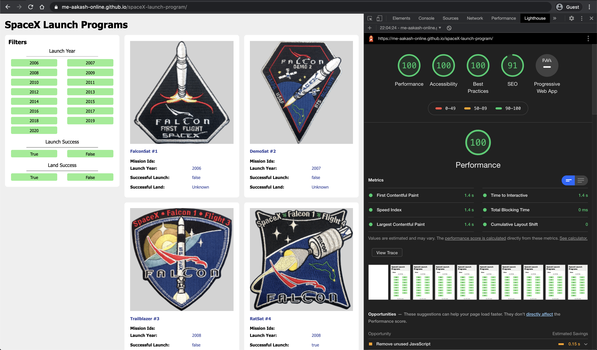

# SpaceX Launcher

A responsive React app to provide stats on SpaceX Launches Programmes

## Key Features

-   Allows for one click search into SpaceX's launch programmes.
-   Responsive to support mobile and tablet devices.
-   Allows for efficient API calls, by cancelling any ongoing API request whenever any filter updates.
-   Handles edge cases like device being offline or data being improper.

## Reports

## Todos

-   [ ] Improve Lighthose Performance Metric by Virualizing List of Initial Render Items.
-   [ ] Write more test cases for API calls.
-   [ ] Use State management tools to avoid prop-drilling and unneccessary re-renders.
